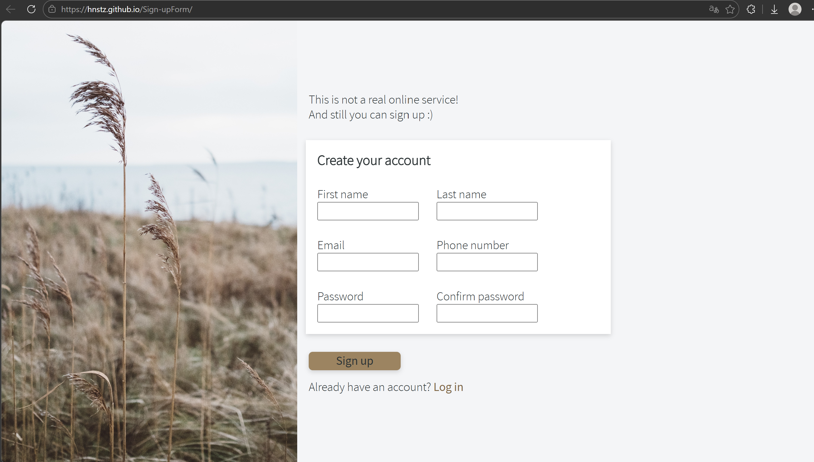
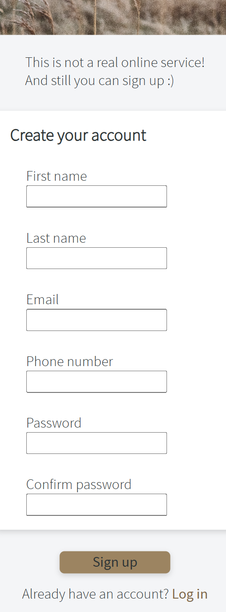

# Sign-Up Form

A responsive, split-screen sign-up form built from scratch. This project serves as a practical application of modern CSS layout techniques, semantic HTML structure, and form accessibility.

## Screenshot

  
  &nbsp; &nbsp; &nbsp;
  

## Features

* **Responsive Layout:** Utilizes CSS media queries to transition seamlessly from a split-screen desktop view to a single-column mobile view.
* **Custom Theming:** Implements CSS Custom Properties (variables) for consistent color palettes, typography, and spacing management.
* **Locally Hosted Fonts:** Integrates custom web fonts (`@font-face`) to ensure design consistency regardless of the user's operating system.
* **Semantic Form Structure:** Uses proper HTML5 input types (`email`, `tel`, `password`) and links `label` elements to their respective `input` fields for improved accessibility and user experience.

## Technologies Used

* HTML5
* CSS3 (Flexbox, Media Queries)

## Key Learnings

Building this project reinforced several important frontend development concepts:

* **Flexbox Mastery:** Managing complex layouts using Flexbox, specifically transitioning from `flex-direction: row` to `column` for mobile responsiveness, and using `gap` for precise spacing between form elements.
* **Form Element Behavior:** Overriding default browser styles for form inputs (such as managing `inherit` properties for typography) and understanding the distinction between internal padding and external margins for UI elements.
* **CSS Specificity and Selectors:** Using advanced CSS selectors (like `:not()`) to apply layout rules efficiently without cluttering the HTML with utility classes.

## How to Run Locally

1. Clone this repository to your local machine.
2. Ensure the file structure remains intact (the `fonts` and `img` directories must be in the same folder as `index.html` and `style.css`).
3. Open `index.html` in your preferred web browser. No local server is required.
